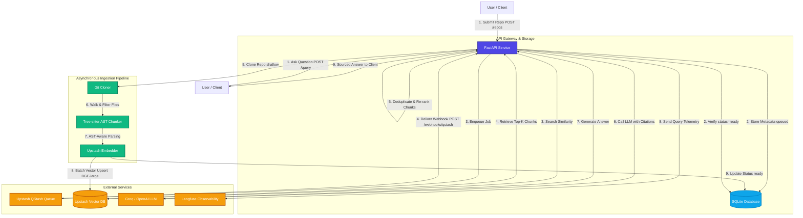

# Codebase Assistant 🚀

[](https://fastapi.tiangolo.com)
[](https://www.python.org/)
[](https://upstash.com/docs/vector/overall/whatisvector)
[](https://langfuse.com)
[](https://opensource.org/licenses/MIT)

An advanced, production-grade **AI Codebase Assistant** that lets users query any GitHub repository in natural language. Powered by **Tree-sitter AST-aware chunking**, serverless **Upstash Vector search**, and high-performance **Groq LLM** execution, it returns precise, context-rich answers complete with direct file and line-number citations.

---

## 🗺️ System Architecture

The codebase assistant is designed with decoupling and efficiency in mind. Below is the system request flow for both the **asynchronous ingestion** and **RAG-based query** pipelines.



---

## 🛠️ Recruiter Highlights & Engineering Decisions

When reviewing this codebase, hiring managers and senior engineers should note the following production-minded patterns:

*   **AST-Aware Chunking (vs. Naive Sliding Windows)**: Instead of slicing code at arbitrary character or token limits—which damages semantic contexts and splits functions in half—we use **Tree-sitter** to parse the codebase AST. Code is chunked at logical boundaries (classes, methods, functions, structs), retaining absolute semantic cohesion.
*   **Asynchronous Job Processing (QStash & Webhooks)**: Repository cloning and chunk ingestion are heavy disk/network operations that exceed standard HTTP gateway timeouts. By leveraging **FastAPI Background Tasks** (for development) and **Upstash QStash webhook delivery** (for production), the pipeline remains highly concurrent and resilient.
*   **Context Prepending & Deduplication**:
    *   To aid the vector database, we extract imports and module-level docstrings and prepend them to each individual function chunk. This keeps necessary import signatures in the local embedding space.
    *   Retrieval results are deduplicated dynamically using line-range overlaps, preventing the LLM context from being filled with overlapping duplicates of the same files.
*   **Zero-Dependency Serverless Embedding**: Using Upstash Vector's built-in **BAAI/bge-large-en-v1.5** model eliminates the need to run local sentence-transformers, pay for OpenAI embedding tokens, or run heavy GPU machines.
*   **Production Telemetry**: Instrumentation using **Langfuse SDK** enables end-to-end tracing, recording token counts, latencies, and generation outputs for RAG evaluation and monitoring.
*   **RAGAS Evaluation Framework**: Built-in evaluation scripts systematically measure **faithfulness** (avoiding hallucinations) and **context precision** comparing Groq Llama 3.3 and OpenAI GPT-4o side-by-side.

---

## 🧬 Technical Deep Dives

### 1. AST-Aware Code Chunker
Standard text splitters are fatal to codebase RAG. `src/ingestion/chunker.py` uses tree-sitter to break code down into semantic units.

*   **Boundary Targets**: Defined by language. For example, Python uses `function_definition` and `class_definition`, while Go uses `function_declaration` and `type_declaration`.
*   **Dynamic Rescaling**: Chunks that exceed `MAX_CHUNK_TOKENS` (1500) are recursively split into smaller child nodes. Nodes smaller than `MIN_CHUNK_TOKENS` (50) are swallowed or folded into siblings to prevent tiny, useless snippets.
*   **Context Injector**: The chunker parses imports/modules using regex-free AST nodes to prepend context headers (e.g., `# class: PaymentManager` + imports), creating optimal embedding text.

### 2. Async Webhook Queue Flow
The API is split into ingestion and query routers:
*   `POST /repos`: Quickly verifies URL legitimacy, writes to SQLite, and fires a non-blocking queue trigger.
*   `POST /webhooks/qstash`: Validates signatures from QStash, executes shallow clones (`depth=1` to optimize bandwidth), chunks files, and performs batched Upstash Vector upserts.
*   `Finally` cleanup blocks ensure that temporary clones are aggressively removed from local storage immediately, keeping disk usage light.

---

## 🗂️ Project Directory Layout

```
.
├── src/
│   ├── api/             # FastAPI routers (repos, query, QStash webhooks)
│   ├── db/              # SQLAlchemy Async + SQLite metadata management
│   ├── ingestion/       # Git cloner, Tree-sitter AST parser, and Upstash Vector embedder
│   ├── retrieval/       # Semantic retriever, range deduplication, and LLM query generator
│   ├── observability/   # Langfuse tracing client
│   ├── models/          # Shared Pydantic request/response schemas
│   ├── config.py        # Pydantic Settings application config
│   └── main.py          # FastAPI application initialization & lifecycle
├── tests/               # Pytest test suite (featuring AST chunker unit tests)
├── eval/                # RAGAS metrics & model comparison suite
├── scripts/             # Seeding script for CLI repository testing
├── Dockerfile           # Multi-stage container definition
└── docker-compose.yml   # Sandbox local compose profile
```

---

## ⚡ Quick Start

### 1. Prerequisites
- **Python**: `>= 3.11`
- **Dependencies**: SQLite, Upstash Vector Index (pre-configured with `BAAI/bge-large-en-v1.5` embeddings, 1024 dims).

### 2. Configure Environment
1. Create a `.env` file in the root directory:
```bash
cp .env.example .env
```
2. Populate the required credentials:
```ini
UPSTASH_VECTOR_URL="https://..."
UPSTASH_VECTOR_TOKEN="..."
GROQ_API_KEY="gsk_..."
# Optional:
OPENAI_API_KEY="sk-..."
LANGFUSE_PUBLIC_KEY="..."
LANGFUSE_SECRET_KEY="..."
```

### 3. Installation
```bash
pip install -e ".[dev]"
```

### 4. Running the Application

**Run via Uvicorn locally**:
```bash
uvicorn src.main:app --reload
```

**Run via Docker Compose**:
```bash
docker-compose up --build
```

---

## 🔌 API Reference

### 1. Submit Repository (`POST /repos`)
Clones, parses, and indexes a GitHub repo asynchronously.

**Request**:
```json
{
  "url": "https://github.com/tiangolo/fastapi",
  "branch": "main"
}
```
**Response (202 Accepted)**:
```json
{
  "repo_id": "8a7f2e1d-4b9c-4f9a-8a7f-2e1d4b9c4f9a",
  "status": "queued",
  "message": "Repository queued for ingestion. Poll /repos/{repo_id} for status."
}
```

### 2. Poll Ingestion Status (`GET /repos/{repo_id}`)
Check ingestion lifecycle status (`queued` ➔ `cloning` ➔ `chunking` ➔ `embedding` ➔ `ready` / `failed`).

**Response**:
```json
{
  "repo_id": "8a7f2e1d-4b9c-4f9a-8a7f-2e1d4b9c4f9a",
  "url": "https://github.com/tiangolo/fastapi",
  "branch": "main",
  "status": "ready",
  "file_count": 142,
  "chunk_count": 894,
  "error": null,
  "created_at": "2026-06-11T12:00:00Z",
  "updated_at": "2026-06-11T12:02:15Z"
}
```

### 3. Ask a Question (`POST /query`)
Query the vector database for answers with source citations.

**Request**:
```json
{
  "repo_id": "8a7f2e1d-4b9c-4f9a-8a7f-2e1d4b9c4f9a",
  "question": "How are route parameter dependencies declared and resolved?",
  "top_k": 8
}
```
**Response**:
```json
{
  "answer": "Route parameter dependencies are declared using `Depends(...)` and resolved during route matching...",
  "sources": [
    {
      "file_path": "fastapi/dependencies/utils.py",
      "node_type": "function",
      "node_name": "solve_dependencies",
      "start_line": 120,
      "end_line": 240,
      "language": "python",
      "score": 0.895
    }
  ],
  "repo_id": "8a7f2e1d-4b9c-4f9a-8a7f-2e1d4b9c4f9a",
  "model": "groq/llama-3.3-70b-versatile",
  "trace_id": "tr-5527-abc",
  "latency_ms": 1420
}
```

---

## 🧪 Testing & Evaluation

### Unit Tests
Execute the unit tests using `pytest`:
```bash
pytest tests/ -v
```

### Model Performance Evaluation (RAGAS)
Run systematic RAGAS quality evaluations comparing Groq and OpenAI:
```bash
# Evaluate retrieval precision and faithfulness with Groq
python eval/run_eval.py --repo-id <repo_id> --provider groq

# Compare side-by-side performance of both LLMs
python eval/run_eval.py --repo-id <repo_id> --compare
```

---

## 🛡️ License
Distributed under the MIT License. See [LICENSE](LICENSE) or details in package sources for more information.
